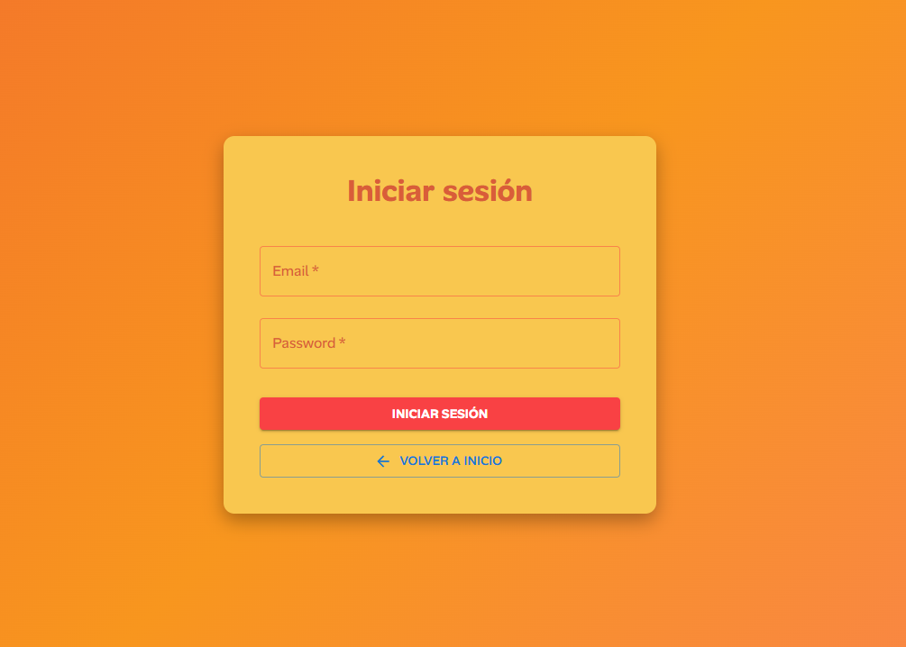
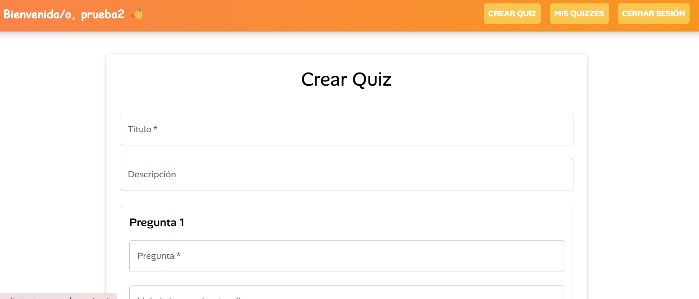
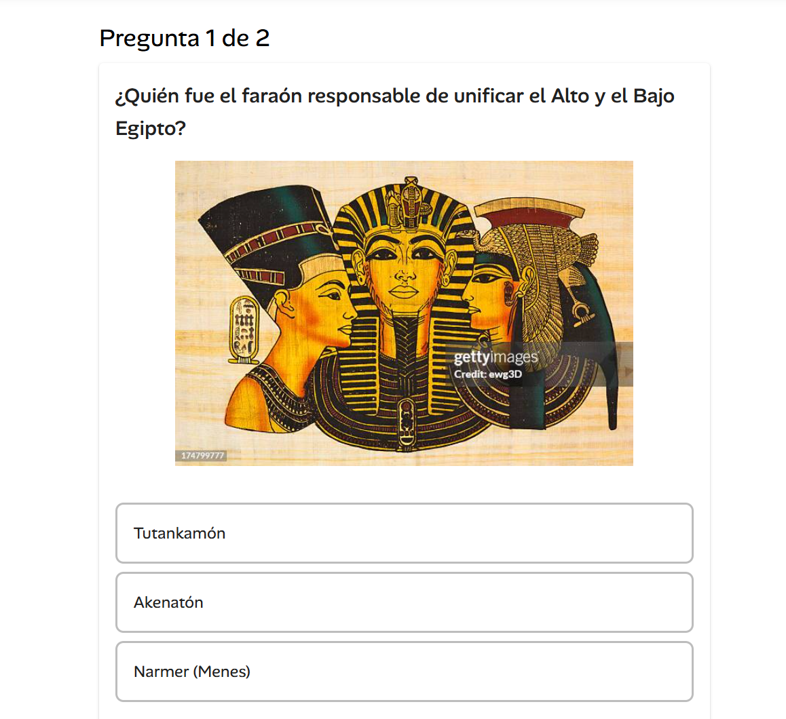

# API-Quizzes: Plataforma de Creación y Gestión de Cuestionarios

## 📄 Introducción
API-Quizzes es una aplicación full-stack diseñada para permitir a los usuarios registrarse, iniciar sesión y crear sus propios cuestionarios (quizzes). La aplicación se basa en una arquitectura de Single Page Application (SPA) donde el frontend (React) se comunica con una API RESTful (Express/TypeScript) y utiliza MongoDB para el almacenamiento de datos.

Este proyecto está optimizado para su despliegue en plataformas como Render.

## Funcionalidades

### Usuarios
- Registro de nuevos usuarios.
- Inicio de sesión con autenticación JWT.
- Bloqueo temporal de cuenta tras 5 intentos fallidos de login (15 minutos).

### Quizzes
- Crear quizzes con título, descripción y preguntas.
- Editar quizzes existentes.
- Eliminar quizzes.
- Obtener todos los quizzes disponibles.
- Operaciones protegidas con token de usuario.

## Tecnologías y Dependencias

### Backend
- Node.js
- Express
- TypeScript
- MongoDB + Mongoose
- JWT (`jsonwebtoken`) para autenticación
- bcrypt (`bcryptjs`) para encriptar contraseñas
- CORS (`cors`) para manejo de origenes cruzados
- Dotenv (`dotenv`) para variables de entorno
- ts-node-dev (para desarrollo)

### Frontend
- React
- Axios
- Material UI (`@mui/material`, `@mui/icons-material`) para UI
- React Router (`react-router-dom`) para rutas

## Endpoints Principales

### Usuarios
POST /api/usuarios/register → Registrarse
POST /api/usuarios/login → Iniciar sesión

### Quizzes

GET /api/quizzes → Obtener quizzes
POST /api/quizzes/create → Crear un quiz (requiere token)
PUT /api/quizzes/:id → Editar quiz
DELETE /api/quizzes/:id → Eliminar quiz

## Instalación local

### 1. Clonar el repo:
git clone https://github.com/beltamz/api-quizzes.git
cd api-quizzes

### 2. Backend
# desde la raíz del repo
cd backend
npm install
# Para desarrollo:
npm run dev        # (si usas ts-node-dev)
# Para compilar a JS:
npm run build      # ejecuta tsc y genera dist/
# Para ejecutar la versión compilada (producción local):
npm run start      # ejecuta node dist/index.js

### 3. Frontend
cd ../frontend
npm install
# Para desarrollo:
npm start          # corre React en http://localhost:3001 (por defecto)
# Para producción / generar build:
npm run build      # genera la carpeta frontend/build

### 4. Configurar variables de entorno del backend

Crea un archivo .env dentro de la carpeta backend con el siguiente contenido:

MONGO_URI=mongodb+srv://<usuario>:<password>@cluster.mongodb.net/<nombre_base>
SECRET_KEY=<clave_secreta_para_jwt>

### 5. Ejecutar el backend en local 

npm run start
El backend estará disponible en http://localhost:3000

### 6. Levantar el frontend
npm start
El frontend estará disponible en http://localhost:3001

### 7. Desplegar en render
a. Sube tu repositorio a GitHub.

b. Crea un nuevo servicio de tipo Web Service en Render y conecta tu repo.

c. En la sección Build Command, utiliza:
cd frontend && npm install && npm run build && cd ../backend && npm install && npm run build

d. En la sección Start Command, usa:
node dist/index.js

e. Configura las variables de entorno en Render con los valores reales de tu proyecto:

MONGO_URI

SECRET_KEY

Render se encargará de compilar frontend y backend y servirlos en un único dominio.

## Link
https://api-quizzes.onrender.com/

## Vista previa 

